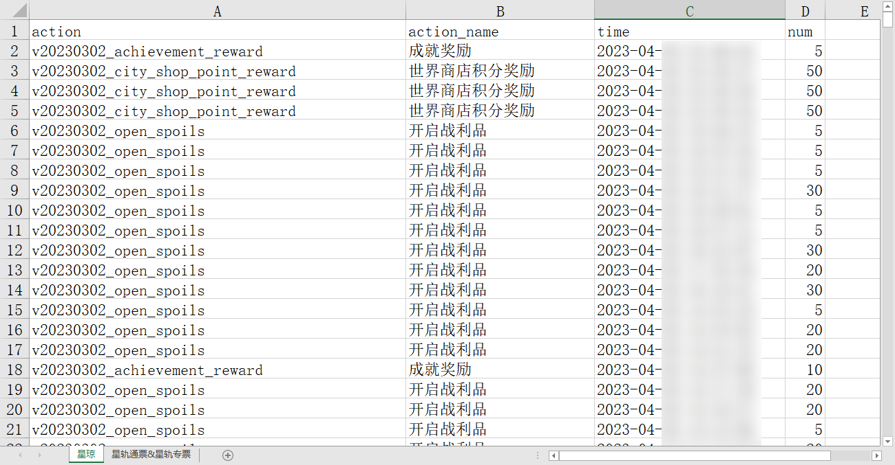

# StarRailTool
星穹铁道小工具（仅有Python版

微联动[Scighost/StarRailTool: 星穹铁道小工具（仅有命令行版](https://github.com/Scighost/StarRailTool)

## 抽卡资源获取情况

**对应 [get_month_detail.py](get_month_detail.py)** 

通过米游社API获取某个月份内获得的`星琼`和`星轨通票&星轨专票`的获取情况，并将数据保存到Excel文件中。

### 使用方法

1. 在`main()`函数中设置`uid`和`month`变量，分别代表用户ID和月份。
2. 运行程序，程序会自动抓取数据并保存到Excel文件中。文件名格式为`uid_month.xlsx。

### 结果截图

## 后台自动静音

**对应 [background_muter.py](background_muter.py)** 

游戏在后台时自动静音，切换到前台时恢复，便于刷本。

仅Windows可用。

### 使用方法

- 先打开游戏
- 再打开`background_muter.exe`