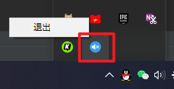
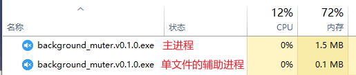
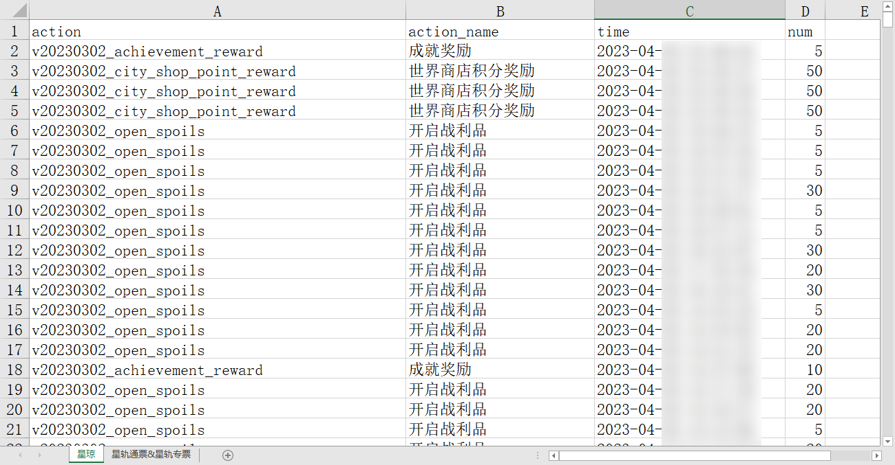

# StarRailTool

星穹铁道小工具（仅有Python版

微联动[Scighost/StarRailTool: 星穹铁道小工具（仅有命令行版](https://github.com/Scighost/StarRailTool)

## 后台自动静音

**对应 [background_muter.py](background_muter.py)，重构于[AutoMuteBG](https://github.com/lingkai5wu/AutoMuteBG)**

游戏在后台时自动静音，切换到前台时恢复，便于刷本（特别是模拟宇宙）。

程序的原理为调用系统的音量合成器，仅Windows可用。

这里的代码写的很烂，要看源码请移步[AutoMuteBG](https://github.com/lingkai5wu/AutoMuteBG)。

### 使用方法

1. 在[releases](https://github.com/lingkai5wu/StarRailTool/releases/latest)或其他镜像下载`background_muter.exe`，也可直接运行`.py`文件
2. 打开游戏本体
3. 打开`background_muter.exe`
4. 关闭游戏后会自动退出本程序，你也可以从状态栏中手动退出。

### 已知问题

- **在游戏运行时强制关闭本程序（例如使用任务管理器或直接关机），本程序无法自动恢复音量**，遇到该问题可以再次启动本程序，或在音量合成器中手动复原。
- ~~有时会忘记自己还在打游戏~~

### 运行截图

## 抽卡资源获取情况

**对应 [get_month_detail.py](get_month_detail.py)**

通过米游社API获取某个月份内获得的`星琼`和`星轨通票&星轨专票`的获取情况，并将数据保存到Excel文件中。

### 使用方法

需要一定Python基础。

1. 在`main()`函数中设置`uid`和`month`变量，分别代表用户ID和月份
2. 运行程序，按提示输入`Cookie`，获取方法在[我的另一个项目](https://github.com/lingkai5wu/getYsFurnitureList)有提到
3. 程序会自动抓取数据并保存到Excel文件中。文件名格式为`uid_month.xlsx`

### 已知问题

- 门槛较高
- 用处不大

### 运行截图

